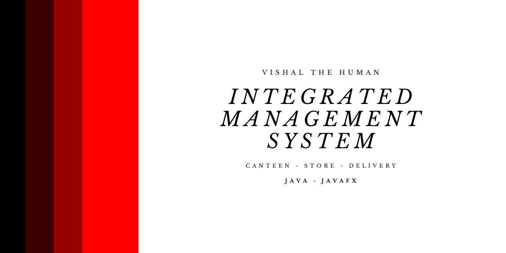
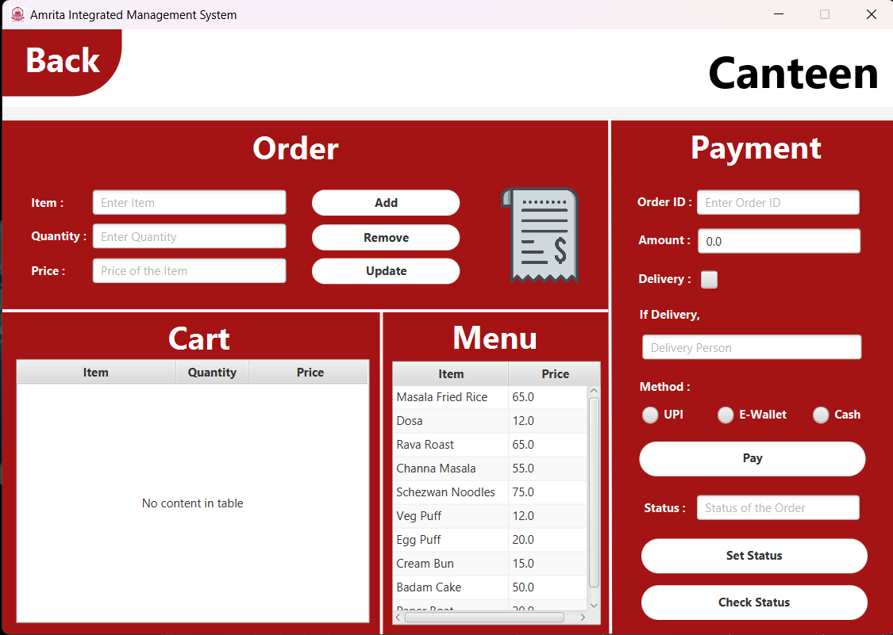
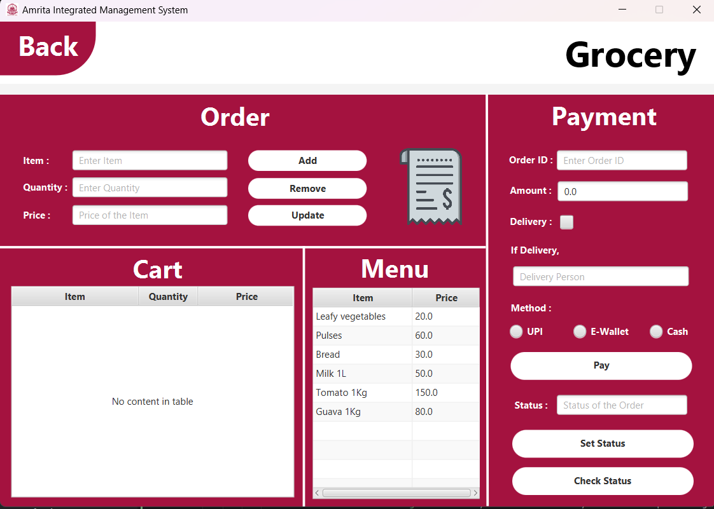
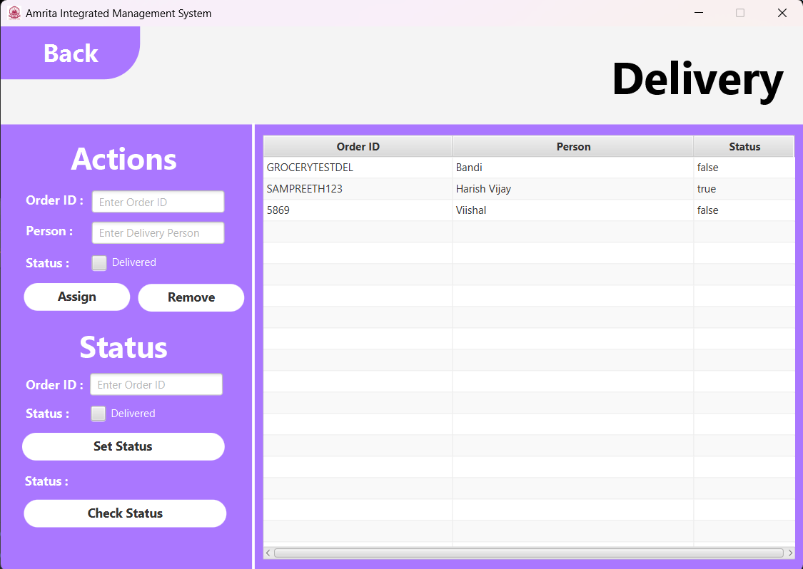
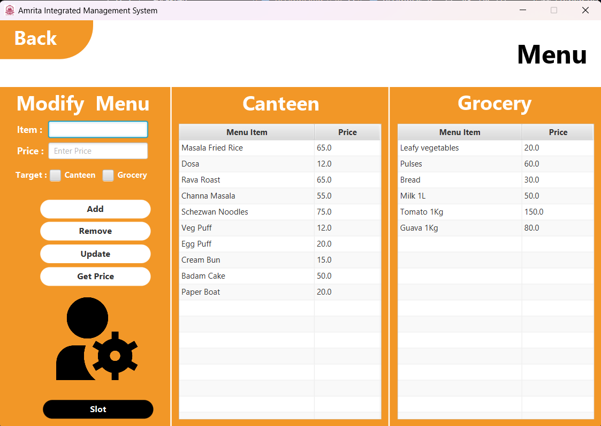
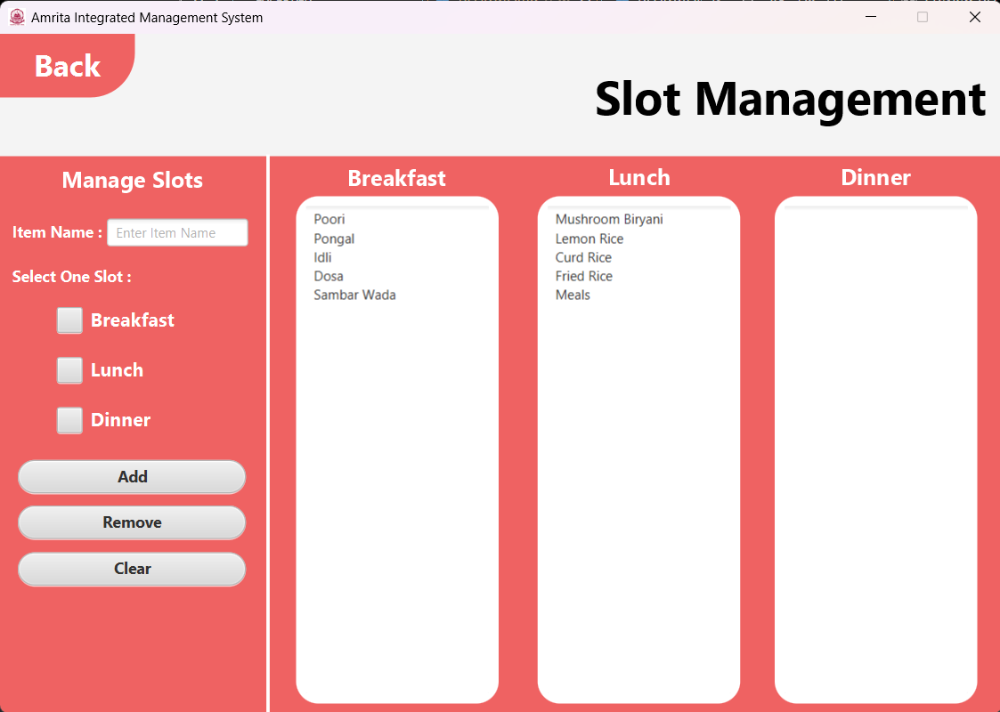
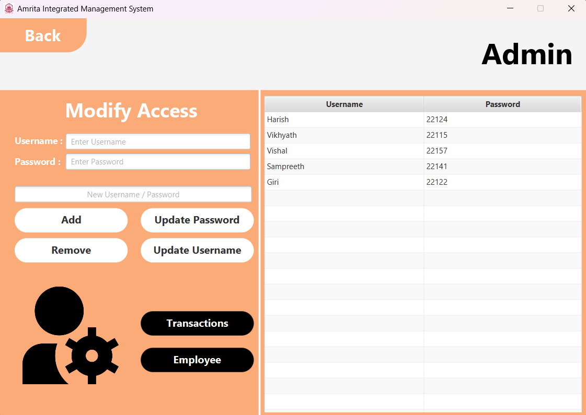
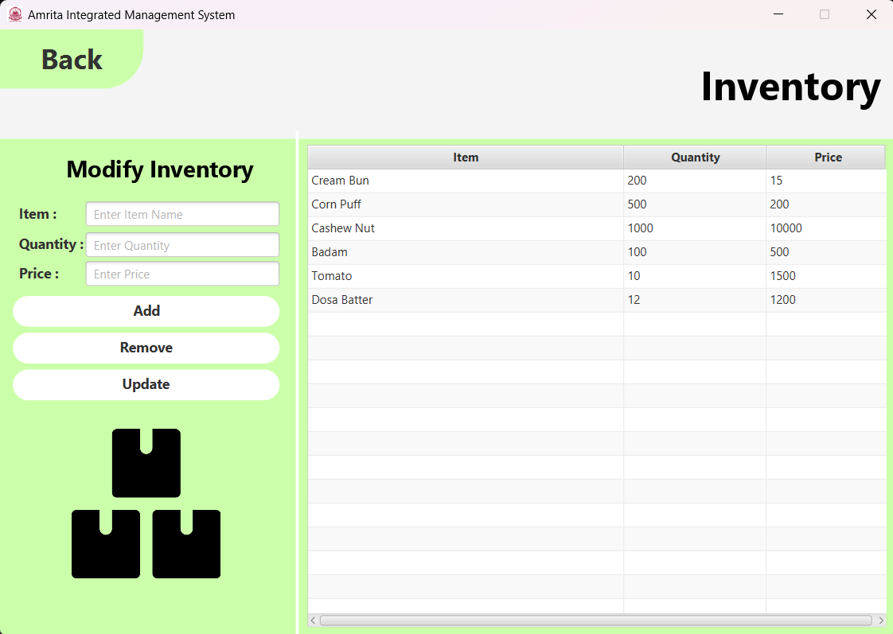
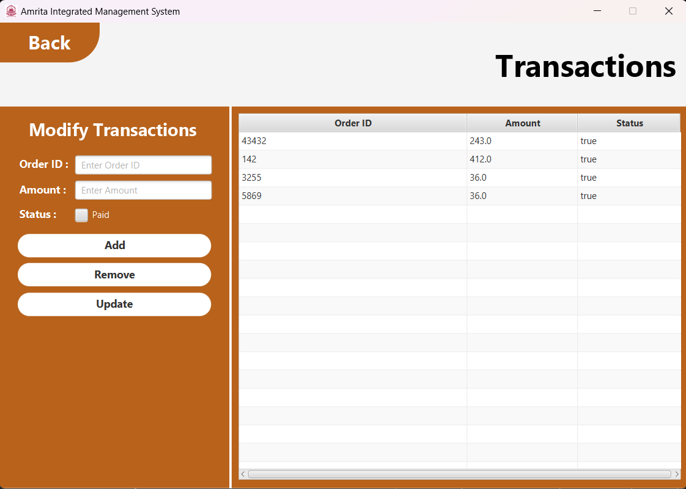
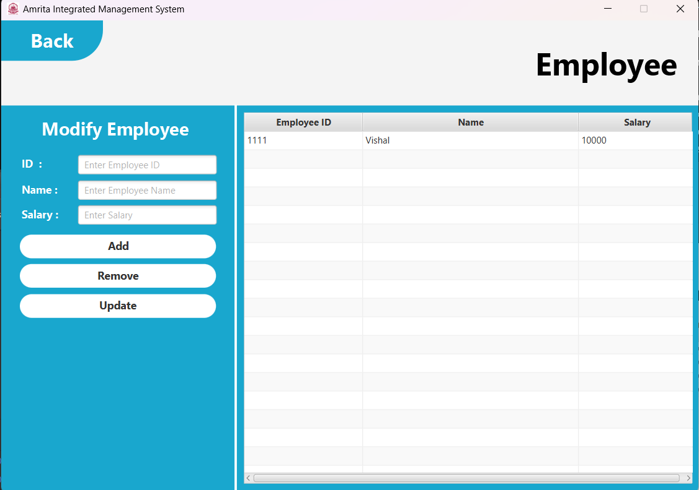

# ```Integrated Management System : Consumer Goods``` 



## **Description 📑**
The Integrated Management System for Canteen, Store, and Delivery is a comprehensive and streamlined solution designed to enhance the efficiency of managing canteen operations, store inventory, and delivery services within an organization. This project leverages Java as the primary programming language and JavaFX for creating an intuitive and user-friendly graphical user interface (GUI).


## **Features 🪶**

### **Canteen and Store Management 🍕**
<ol>
<li><b>Order Placement : </b>Users can easily place food orders through a user-friendly interface.</li>  
<li><b>Menu Management : </b>The system facilitates the management of canteen menus, allowing administrators to update items, prices, and availability. </li>
<li><b>Payment Integration : </b> Seamless integration of payment systems ensures secure and convenient transactions.</li>
</ol>
  

### **Store Inventory Management 🏪**
<ol>
<li><b>Real-time Inventory Tracking : </b> Keep track of stock levels, automatically updating as items are added or sold.  </li>
<li><b>Order Dispatch : </b>Efficiently dispatch orders to delivery personnel.</li>
<li><b>Delivery Confirmation : </b> Capture confirmation of successful deliveries and update order status accordingly.  </li>
</ol>

### **User Authentication and Authorization 🧑‍🦰**
<ol>
<li>
<b>Secure Login : </b> Implement a robust authentication system to ensure only authorized personnel can access the system.
</li>
</ol>

### **User Interface 😶‍🌫️**
<ol>
<li>
<b>Intuitive Design : </b> JavaFX provides a visually appealing and intuitive user interface, enhancing the overall user experience.
</li>
<li>
<b>Responsive UI : </b> The GUI is responsive and user-friendly, ensuring smooth navigation and interaction.
</li>
</ol>

## **Graphical User Interface (GUI) 💻**










